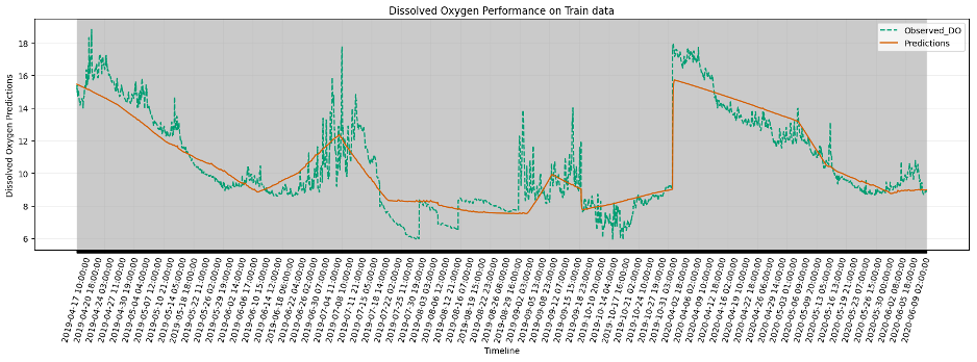

# Predicting Dissolved Oxygen Dynamics in Lake Mendota using Transfer Learning
### The project explores transfer learning models for predicting dissolved oxygen levels in Lake Mendota. 

- The approach addresses the challenge of limited data in environmental science by transferring underlying trends from related environments, enhancing prediction accuracy and reliability even with sparse target environment data. 

- The method involves pre-training the model with data from various lakes and fine-tuning it with Lake Mendota-specific data. Integrating scientific knowledge, such as understanding environmental factors affecting DO levels, into the machine learning process, offering improved predictions. 

- The findings demonstrate that transfer learning not only enhances prediction accuracy but also promotes scientific research and technological innovation with more precise and interpretable models.

### Data Sources
-  Data were collected from two primary sources: high-frequency datasets and [low-frequency datasets](./lakes21_parquet/LowFrequency)

### Data Preprocessing
- [Data preprocessing](./20_lakes_data.Rmd) involved the following key steps to ensure consistency and usability:
  1. Data Filtering
  2. Downsampling
  3. Data Merging
  4. Interpolation
 
- This preprocessing resulted in two datasets: [lake_me_year.csv](./lakes21_parquet/lake_me_year.csv), specific to Lake Mendota with hourly measurements of surface DO, temperature, TP, TN, and Secchi depth, and [combined_13_lakes.csv](./lakes21_parquet/combined_13_lakes.csv) encompassing the same variables for the other 13 lakes.

### LSTM Models Training
  1.	Initialization: Model hyperparameters, including model type, hidden layer size, output size, number of layers, and learning rate, were initialized to define the model architecture.
  
  2.	Data Samples Generating: We define the lookback window, horizon window, and stride to create individual samples and determine the total number of samples. Also, specify the batch size for single training iteration. The data is fed into the model in batches. For each batch, the model computes the loss and adjusts its parameters using an optimization algorithm to minimize this loss.
 	
  3.  Evaluation: At the end of each training epoch, the model's performance was assessed both on train and test sets split sequentially according to a predefined train-test ratio using the Root Mean Square Error (RMSE) metric.

### Model Experiment

To test the model's robustness with sparse data, I reduced the dataset to one-fourth of its original size and compared the results with the full dataset. 
**The following files show the model training process in Jupyter Notebook.**

- Transfer Learning Model (TL)
  1. **[tl_2372.ipynb](./lakes21_parquet/tl_2372.ipynb)** : TL model tested on 2372 data points

  2. **[tl_9487.ipynb](./lakes21_parquet/tl_9487.ipynb)** : TL model tested on 9487 data points

- Machine Learning Model (ML)
  1. **[ml_2372.ipynb](./lakes21_parquet/ml_2372.ipynb)** : ML model tested on 2372 data points

  2. **[ml_9487.ipynb](./lakes21_parquet/ml_9487.ipynb)** : ML model tested on 9487 data points
 
### Result

Observed dissolved oxygen (DO) levels (dashed green line) and the machine learning(ML) model's predictions (solid orange line) over time for the training dataset.

